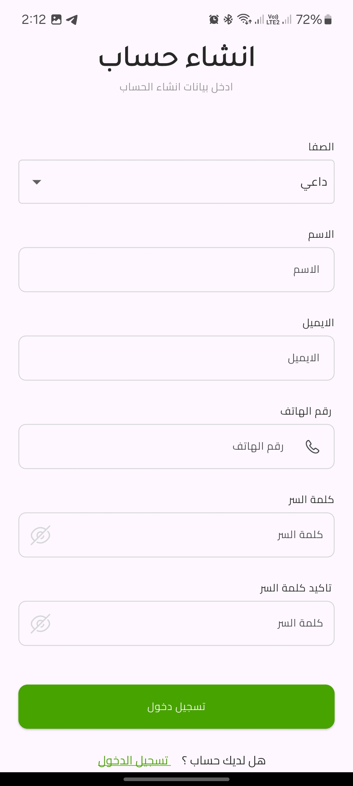
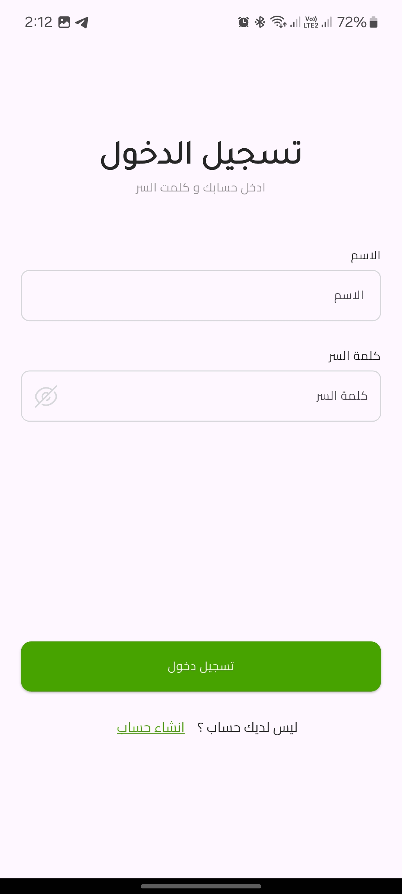
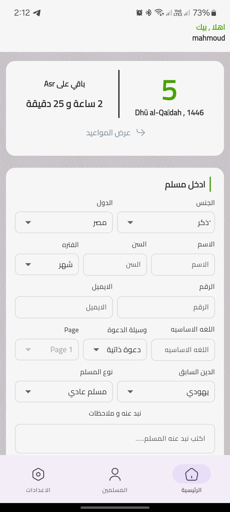
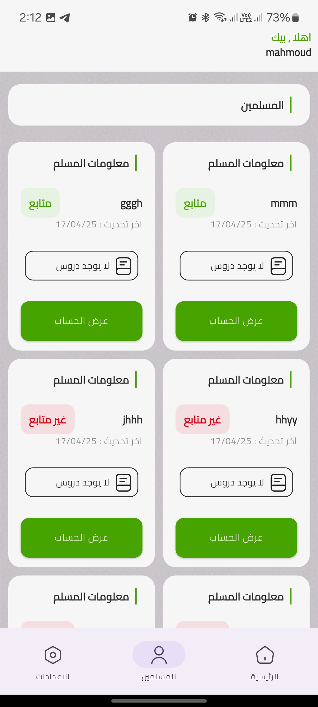
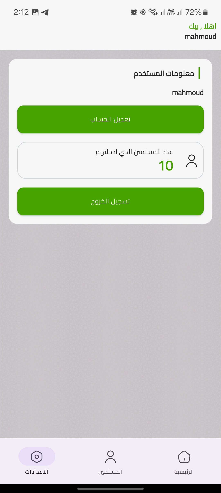

# 🌙 Dae - Islamic Mentor Platform  

**Connecting new Muslims (Dae) with qualified teachers (Moalem) for structured Islamic education.**  

  

## ✨ Key Features  

| Feature                | Dae (Student) | Moalem (Teacher) |
|------------------------|---------------|------------------|
| Profile Creation       | ✅            | ✅               |
| Prayer Time Integration| ✅            | ✅               |
| Student Adoption       | ❌            | ✅               |
| Progress Tracking      | ✅ (View)     | ✅ (Edit)        |
| In-App Notes           | ✅ (Receive)  | ✅ (Create)      |

**Technical Highlights**:
- 🚀 **Flutter 3** with Null Safety
- 🔥 **Firebase Auth & Firestore** for real-time data
- 🕌 **Prayer Times API** with geolocation
- 📊 **Getx State Management**

## 📱 Screenshots  

  
  
<!--    -->
  
  
  
  

---

## 📥 Download APK

Install the app on Android:  
📱 **[Download APK](https://drive.google.com/file/d/1PVdENQMZXSImiEoDosCAlppOaGRFm7xa/view?usp=drive_link)**

---

